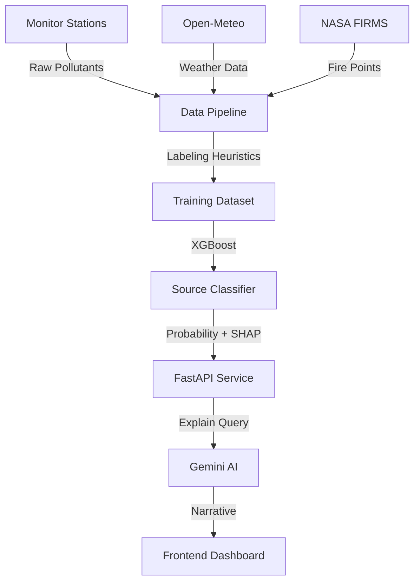

# PIE Engine: Technical Reference & Modeling Guide

This document provides a deep dive into the architecture, data processing, and machine learning models behind the **Pollution Intelligence Engine (PIE)**.

---

## 1. Data Modeling & Infrastructure
The PIE Engine operates on a **Data Fusion** model, merging three distinct types of environmental signals to create a high-dimensional state of the atmosphere.

### 🌐 Data Sources
| Dataset | Frequency | Features Extracted | Provider |
| :--- | :--- | :--- | :--- |
| **Chemical** | Hourly | PM2.5, NO2, PM10 | OpenAQ (DPCC) |
| **Meteorological** | Hourly | Wind (S/D), Temp, Humidity, Pressure, Boundary Layer | Open-Meteo |
| **Satellite** | Real-time | Fire Count, Total FRP, Upwind Flag | NASA FIRMS (VIIRS/MODIS) |

### 🛠️ The Pipeline (`data_pipeline.py`)
The pipeline follows a standard ETL (Extract, Transform, Load) pattern:
1. **Acquisition**: Fetches historical and forecast data from APIs with disk-based caching.
2. **Alignment**: Resamples all sources to a common hourly resolution and joins them spatially by monitoring station coordinates.
3. **Synthesis**: Creates advanced interaction features.
4. **Labeling**: Uses a research-backed heuristic engine to generate the "Ground Truth" for training.

---

## 2. Feature Engineering Logic
Raw sensor data is insufficient for source attribution. We transform the raw inputs into **48 specialized features** that capture the "fingerprint" of pollution.

### 🧪 Chemical Ratios
*   **PM10 / PM2.5 Ratio**: A primary marker for Dust. High ratios (>2.0) indicate coarse particles from roads or construction.
*   **PM2.5 / NO2 Ratio**: Used to identify Combustion vs. Secondary formation. A low ratio often signifies fresh vehicular exhaust (High NO2).

### 🌫️ Meteorological Interaction
*   **Stagnation Index ($RH / WS$)**: High humidity and low wind speed trap pollution and promote chemical reactions.
*   **Dispersion Index ($WS \times Temp$)**: Represents the air's ability to dilute pollutants.
*   **Wind Direction Bias**: Categorizes wind into 8 sectors (N, NE, E, etc.) and specific bearings (e.g., 300°-360° for Punjab stubble smoke).

### 🛰️ Spatial & Fire Features
*   **Upwind Fire Flag**: Uses trigonometry to check if a detected NASA fire is located "behind" the wind direction relative to the sensor.
*   **Distance to ROI**: Haversine distance to the nearest Highway, Industrial Cluster, or Brick Kiln.

---

## 3. The Heuristic Labeling System
Since urban air quality lacks direct "labels", we use **Physically-Based Heuristics** derived from Delhi-based atmospheric research (CPCB, SAFAR, IIT) to label our training data.

### Label Logic Summary
| Label | Scientific Rationale |
| :--- | :--- |
| **Traffic** | High PM2.5 + High NO2 (>40 µg/m³) + Rush Hour + Highway proximity. |
| **Biomass** | High PM2.5 + Stubble Season (Oct/Nov/Apr) + NW Wind OR Upwind Fire detected. |
| **Dust** | High coarse fraction (PM10/PM2.5 > 2.2) + Dry conditions (RH < 40%). |
| **Secondary** | High RH (>70%) + Winter (Nov-Feb) + Stagnation. Targets Nitrate/Sulfate formation. |
| **Inversion** | Extremely low temperature (<10°C) + Night + Calm winds. |
| **Firecrackers** | Festive date + Evening/Night + Extreme PM2.5 spike (>250) + Low wind. |

---

## 4. Machine Learning Model
### XGBoost Classifier
The core model is an **Extreme Gradient Boosting (XGBoost)** classifier.

*   **Why XGBoost?**: It handles non-linear relationships, respects feature importance ranking, and deals natively with missing values (common in sensor networks).
*   **Training Strategy**: 
    *   **5-Fold Stratified Cross-Validation**: Ensures every source class is represented in every training fold.
    *   **Class Weighting**: Uses `balanced` sample weights to prevent the model from ignoring rare events (like firecrackers or clean air).
*   **Output**: Multi-class probability distribution across 9 categories.

### Interpretation Layer
1.  **SHAP Values**: We use SHAP (SHapley Additive exPlanations) to provide feature-level explanations for every prediction.
2.  **AI Explanation (LLM)**: The Gemini-Flash model translates the model's scores into human-readable narratives for public and administrative use.

---

## 5. System Architecture

